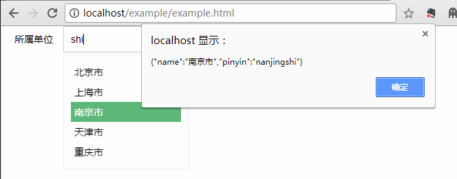

# A layui autocomplete module
I'm writing a project which uses layui as my front end framework, but I found it does not have an autocomplete module.

So let me make one.

# How to use it
>1. Copy files from src folder into you project.
There are simply two files in the folder, one js , one css.
Copy them into your css folder and js folder.

>2. Import css file in the top of your html file
```html
<link rel="stylesheet" href="/public/css/layuiAutocomplete.css">
```
>3. Use the module in layui 2 standard way
```javascript
layui.config({
            base: '/public/js/' //假设这是layuiAutocomplete.js所在的目录
        }).extend({ //设定模块别名
            autocomplete: 'layAutoComplete'
        });
```
>4. Use it in your module or code
```javascript
layui.define(['autocomplete'], function (exports) {
    layui.autocomplete({
        element: '#user-department',
        array: departmentList
    })
    exports('YourModule',something)
}
```

# Config
It is quite easy to use it, just like other layui modules.

You just need write a standard layui input as following
```HTML
<input type='text' class="layui-input" name="department" id="user-department">
```
then in your module
```javascript
layui.autocomplete({
    element: '#user-department',
    array: departmentList
})
```

## About config
There is a configuration object in autocomplete function.

Here is the complete one
```javascript
{
        num: 2, /*how many characters while trigger autocomplete*/
        array: [{name:'北京',pinyin:'beijing',description:'中国的首都'}],/*a local array which contains all elements, you can ignore this if your data is from remote.*/
        display: 'name', /* the display property in the search list,if you don't set it,then it will treat list item as display label directly */
        shortcut: 'pinyin',/*except 'display' property which you can also use to search items. For example: when type “北京”, you may also type 'beijing' to search it, if you put 'beijing' in pinyin property */
        url: 'url', /*remote url, where you can fetch data, a param 'search' will pass the words you input with post method.*/
        query: {},/* what you may want to put into remote query also*/
        resArray: 'data', /* which real data list property name in remote respose */
        element: '#cssselector', /*the input element css selector*/
        count: 10, /* how many to display most in the search list*/
        done: function /*if you want to do something after an item is selected, then write a function here. And the selected item will be passed.*/
    }
```

## An example

```HTML
<div class="layui-inline">
    <label class="layui-form-label" style="width:60px">所属单位</label>
    <div class="layui-input-inline" style="width:180;">
        <input type='text' class="layui-input" name="department" id="user-department">
    </div>
</div>
<script>
    layui.config({
        base: '/public/js/' //假设这是test.js所在的目录
    }).extend({ //设定模块别名
        autocomplete: 'layAutoComplete'
    });
    layui.use(['autocomplete'], function () {
        var departmentList = [{name:'北京市',pinyin:'beijingshi'},{name:'上海市',pinyin:'shanghaishi'},{name:'南京市',pinyin:'nanjingshi'},{name:'天津市',pinyin:'tianjingshi'},{name:'重庆市',pinyin:'chongqingshi'}]
        layui.autocomplete({
            element: '#user-department',
            array: departmentList,
            num:1,
            count:5,
            done:function(item){
                alert(JSON.stringify(item))
            }
        })
    })
</script>
```


Check above example in example folder please.

# At last
Long live bugs, you can help to improve.
